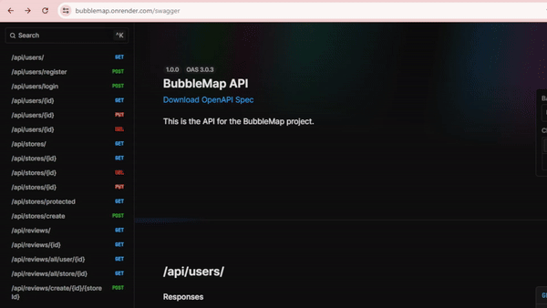
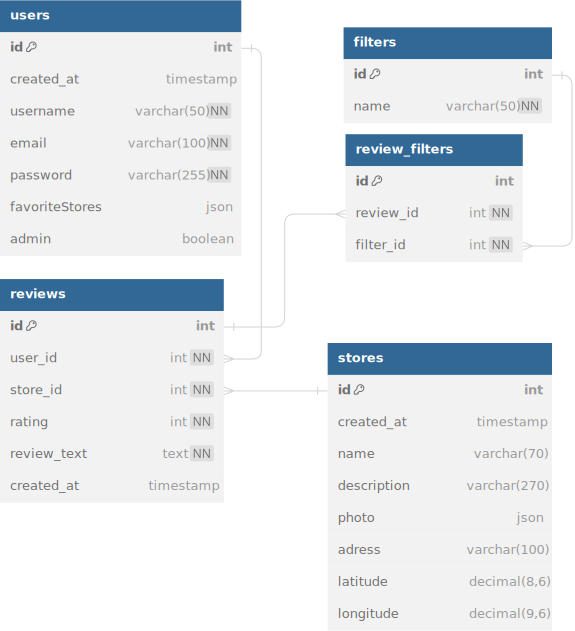
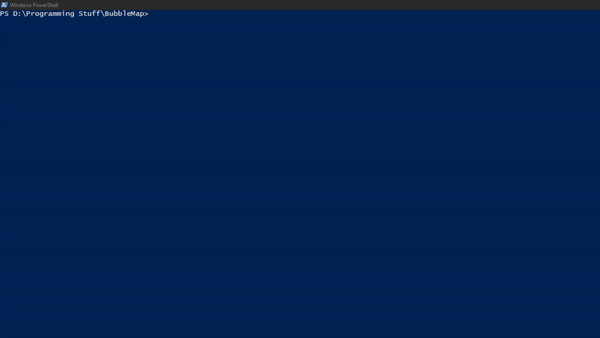

This application was developed as a final project for a Full Stack Webdev course.
It received a score of 20 out of 20. 

# BubbleMap


## Project Description

A website that displays a dynamic map of all bubble tea stores nearby, allowing users to log in/register, review stores they have visited and check out others' reviews. Users can manage their own reviews (CRUD). Admins are additionally able to create new stores and manage them.

### Frontend


The Frontend includes usage for most of the API endpoints. Check its specific repo for more information:

- [BubbleMap-frontend](https://github.com/SebilleK/BubbleMap-frontend)


### General Information

Install dependencies:

```bash
bun i
bun pm trust --all
```

To run:

```bash
bun run dev
# or
bun start
```

This project was created using `bun init` in bun v1.1.9. [Bun](https://bun.sh) is a fast all-in-one JavaScript runtime.

## Deployment


~~Live on Render:~~
**NOT UPDATED**

https://bubblemap.onrender.com/swagger **- API DOCS**

https://bubblemap.onrender.com/api/stores **- GET ALL STORES**



The backend and database are deployed on Render (free-tier), as such **I changed the DB from MySQL to PostgreSQL**, as instances of MySQL databases are not offered for free.

The changes needed for this are present in the **render-deploy** branch (with a render.yaml file for the blueprint and the needed Prisma schema changes. I added the render.yaml file to this branch as well).

Sources:

- https://docs.render.com/free
- https://docs.render.com/infrastructure-as-code

Render natively supports Bun and hosting an ElysiaJS app.

Some notes on the render.yaml file:

- **Runtime should be set to "Node"**
- **The region has to be the same if you want to connect 2 instances (a database and a web service) using the provided internal connection**

Sources:

- https://docs.render.com/deploy-elysiajs
- https://community.render.com/t/internal-db-connection-not-working/12563/2

I couldn't run my pre deploy commands on render due to that being restricted for the free tier, so I used DBeaver to manage locally a connection to the deployed PostgreSQL database and run my needed prisma commands there:

```bash
bunx prisma generate && bunx prisma db push && bunx prisma db seed
```

After that, the deployed service works with the deployed database (populated with dummy data).

## Quickstart

You can either set up the project with or without Docker. Precise instructions for both can be found below.

Getting Docker to containerize everything successfully and running database migrations with Prisma after can be a challenge. If you plan on using it, read the **Setup with Docker** section carefully and if it doesn't work please refer to the **Dockerization** section.

I recommend jumping over to the **Setup without Docker** section for the above reasons if you don't need Docker.

**Quick Reference:**

```bash
bun i
bun pm trust --all # if needed, trust dependencies
bunx prisma generate # Generate a new prisma client
bunx prisma db push # Deploy our database schema to create the database
bunx prisma db seed # Seed the database with some dummy data
bun run dev # Start server
```

## Getting Started — Setup the project

### Setup with Docker

To start, clone this repo:

```bash
git clone https://github.com/SebilleK/BubbleMap.git
```

and make sure to have a valid .env file. For a better look at its needed specifications please refer to **src/env/index.ts**. You also have **.example-env** in the **src/** directory to see how it should look like.

**1. Docker | Build images and start the containers:**

```bash
docker-compose build
docker-compose up
```

**2. Alter your .env** so that DB_HOST is "127.0.0.1" and NOT "mysql". **Docker will use the latter one, while deploying the database with Prisma uses the first one.** (Important fix!)

It's important to do this because the Prisma CLI runs on your host machine, not within docker, and the host machine would not recognize "mysql" as a valid host.

**3. Prisma | Open a new CLI and run:**

```bash
bunx prisma db push
```

4. Open http://localhost:{API_PORT}/users

You should now be able to make requests. Try creating a new user! **(see src/requests)**. [REST Client VSCode Extension](https://marketplace.visualstudio.com/items?itemName=humao.rest-client)

Please refer as well to the **Database > Data for Testing** section to seed the database with some dummy data.

Open http://localhost:{API_PORT}/swagger to see API documentation.

### Setup without Docker (EXAMPLE)

**1. Database setup**

Start by **cloning the repo**:

```bash
git clone https://github.com/SebilleK/BubbleMap.git
```

Then make sure to have a **valid .env** file. For a better look at the needed environment variables please refer to **src/env/index.ts**. You also have **.example-env** in the **src/** directory to see how it should look like.

After that, you can use any tools to set up and manage the database.

For ease of use, I recommend using [XAMPP](https://www.apachefriends.org/) to start up MySQL and the VSCode extension [Database Client JDBC](https://marketplace.visualstudio.com/items?itemName=cweijan.dbclient-jdbc) to manage the connection.

Alternatively to this extension, [MySQL Workbench](https://www.mysql.com/products/workbench/) can work too.

After using your preferred tools for this and making sure you have a valid database setup, proceed.

**2. Install all needed dependencies + Prisma setup**

```bash
bun i
bun pm trust --all # if needed, trust all the dependencies to install them
```

Next we should generate the prisma client and deploy our schema:

```bash
bunx prisma generate # Generate a new prisma client
bunx prisma db push # Deploy our database schema to create the database
```

You can see the schema we're pushing to create our "bubblemap" database on **prisma/schema.prisma**

If you're using the suggested VSCode extension, refresh it. Then you should be able to see the database that was just created.

**3. Start the app**

Finally, start up the app in development (with --watch) or normal mode:

```bash
bun run dev # server restarts on code changes
# OR
bun start
```

Open http://localhost:{API_PORT}/api/users — there should not be anything there, so try to create a user!

[REST Client VSCode Extension](https://marketplace.visualstudio.com/items?itemName=humao.rest-client): Go to **requests/create_user.rest** and send a request. Refresh the page and it should be there.

Please refer as well to the **Database > Data for Testing** section to seed the database with some dummy data.

Open http://localhost:{API_PORT}/swagger to see API documentation.

---

## Dockerization

**Extra section for additional problems if setting up this project using Docker.**

With docker compose:

```bash
docker-compose build # build the docker images for the db and the app
docker-compose up # start the containers
```

If any troubles setting up the containers arrise, please check **docker-compose.yml** and **make sure your .env is correctly set**. For a better look at its specifications please refer to **src/env/index.ts.**.

Additionally, if you get an error **"port is already allocated"** even though you already **removed all containers** and **restarted** the docker service, make sure that no other apps are using this port. If that doesn't work, try to either map it differently or **disable port binding** in **docker-compose.yml**, as it may fix this issue:

```bash
    ports:
      - 3000
```

Removing the containers on Docker Desktop by deleting them directly can cause issues. Try to stop and remove them always with the following command for "graceful" cleanup:

```bash
docker-compose down # stop containers and remove them + their networks and volumes
```

**Important note on Docker + Bun + Prisma**

- Using Prisma in Docker has known issues if you choose to use Bun. This is especially true in Windows. They appear to be fixed as of this project's used bun release, but if you still have trouble with it there are fixes for this.

- One of these workarounds is to include NodeJS in the generated Docker images. Even though it defeats the purpose of using Bun as a replacement for NodeJS, it still DOES solve the problem.

- The Dockerfile includes a comment for the mentioned fix.
  Source: https://github.com/oven-sh/bun/issues/5320#issuecomment-1730927088

- Please check these threads as well for more information on this issue and possible fixes:

  "Bun: Can't prisma generate on Docker"
  https://github.com/prisma/prisma/issues/21241

  "Bun doesn't run prisma generate or prisma migrate inside docker"
  https://github.com/oven-sh/bun/issues/5320

  "@prisma/client did not initialize yet. Please run "prisma generate" and try to import it again"
  https://stackoverflow.com/questions/67746885/

  A short narrative blog post on a Prisma + Docker conflict of its author
  https://medium.com/@simmonsfrank/beautiful-elysia-imprismad-in-a-jail-6518dd2af586

## Database

This project uses Prisma for database queries. It uses its own schema definition language to define database relationships, so it's important that that is set up adequately first. **(See prisma/schema.prisma)**.

When needed, the prisma client is always imported from **prisma/prisma.ts**.

If needed, equivalent MySQL syntax is provided in **src/database/createdb.sql** to create the "bubblemap" database with the intended schema.

Generate the Prisma Client:

**(Caution: running this in Docker is not supported by earlier versions of Bun!)**

```bash
bunx prisma generate
```

For initial database deployment:

(Please refer to the steps in the **Quickstart** section for this command to work **if you're using Docker**)

```bash
bunx prisma db push
```

### Data for Testing

To create dummy data for this database so you can test endpoints, etc.: you can use the provided MySQL queries in **src/database/queries**. Create the users, stores, and reviews — in this order.

It is also possible to use a seed command to create dummy data using Prisma! This will be equivalent as doing the above.

Simply run this after database deployment:

```bash
bunx prisma db seed
```

The above command will execute the script present in **src/database/scripts/seed.ts**. After doing so, to test user only or admin only endpoints you can login with the right credentials:

**Login as an admin:**

```bash
{
    "email": "admin@test.com",
    "password": "unsafe_password_admin"
}
```

**Login as a normal user:**

```bash
{
    "email": "user1@test.com",
    "password": "unsafe_user_password1"
}
```

### Extra Notes

**For warnings on Foreign key constraints when deleting/updating records:**

Please refer to:

- https://www.prisma.io/docs/orm/prisma-schema/data-model/relations/referential-actions

This project uses _onDelete: Cascade_ to delete Reviews by default if the user who created them is deleted OR if the store they correspond to is deleted.

**Seeding the database (compatibility issues):**

Bun has some known compatibility issues with Prisma, so the way we can seed the database is a bit limited (in other words, the way presented in the official Prisma docs doesn't work). For now, this uses the workaround mentioned here:

"Bun: Prisma fails silently when seeding with bun with top level async function"

- https://github.com/prisma/prisma/issues/21324#issuecomment-1751945478

Prisma docs on seeding:

- https://www.prisma.io/docs/orm/prisma-migrate/workflows/seeding#example-seed-scripts

### Database Schema



- I used this platform to design the following database schema: [dbdiagram.io](https://dbdiagram.io/d). You can export your schema to pdf, mysql, etc:..

### Why MySQL and not other database management system?

- I decided to use a relational database mainly to preserve the relationships needed between users/reviews and reviews/stores (since those are at the core of this project) and as such guarantee less mistakes in their interconnectedness over a NoSQL database like MongoDB, as well as ensuring data integrity.

- Adding to that, I chose MySQL because:

  1. It is free, open source, and the most widely used SQL database;
  2. It can handle considerable scalability and growing complexity and strikes a good balances between features/performance;
  3. The most particular type of data stored are coordinates, and their usage for the implemented functionality in this project is relatively simple, so there is no need for advanced geospacial features (PostgreSQL with PostGIS);

- **Note on the data type used to store coordinates:**
  https://stackoverflow.com/questions/1196415/what-datatype-to-use-when-storing-latitude-and-longitude-data-in-sql-databases

---

## ElysiaJS

This project uses ElysiaJS. It's a web framework similar to Express but focused on performance, that takes advantage of Bun (and is very commonly used with it). Read more about it on [ElysiaJS' website](https://elysiajs.com/) or in this [blog post](https://dev.to/oggy107/elysia-a-bun-first-web-framework-1kf3).

**Elysia Docs:**

- https://elysiajs.com/integrations/cheat-sheet.html

- https://elysiajs.com/essential/context

- https://elysiajs.com/essential/life-cycle.html

For a good example on how to build a simple REST API with Bun, Elysia and Prisma, check here:

- https://blog.thecodebrew.tech/create-bun-rest-api-with-elysia-and-prisma/

I based my **src/routes** organization on it.

## Error Handling

I used Elysia's native error handling for all errors. Elysia supports these:

```bash
NOT_FOUND
INTERNAL_SERVER_ERROR
VALIDATION
PARSE
UNKNOWN
```

When throwing validation errors Elysia expects 3 arguments, the second one being a schema that represents the validation rules being applied in that case. Those are very simple for this project and defined here in **src/utils/errors/validationSchemas.ts** using [sinclair/typebox](https://github.com/sinclairzx81/typebox).

For more information on how Elysia handles errors check out:

- https://elysiajs.com/life-cycle/on-error

I used the **"set"** property on Response to set the HTTP status on the route handlers and beforeHandle(s). (This includes error status like 401).

- https://elysiajs.com/essential/context

Example on the beforeHandle of a login-protected route:

```bash
beforeHandle: async ({ set, cookie: { cookieAuth } }) => {
# AUTH Logic: check if token is valid (user logged in)
# console.log(cookieAuth);
	if ((await confirmLogin(set, cookieAuth)) === false) {
		return (set.status = 'Unauthorized');
	}
}
```

This would return a 401 Unauthorized response if the user is not logged in and tries to access the route.

## Authentication + Cookies

I implemented simple JWT-based authentication for 2 levels: user and admin. For having user privileges you need to be logged in, and for having admin privileges you need to be an admin.

### Generating JWT

I used the jsonwebtoken library to generate, verify and decode JWT. All the utilities for this were defined in **src/utils/auth/authJWT.ts**

In the login route handler (**loginUser** function present in **src/routes/users/handlers.ts**) I generate a JWT for the user and store that into a cookie:

```bash
# (...)
# GENERATING JWT TOKEN

const accessToken = await generateToken(user);

if (!accessToken) {
	throw new InternalServerError('An access token could not be generated.');
}

# SETTING AUTH COOKIES
cookieAuth.value = {
	accessToken: accessToken,
};

return {
user,
accessToken: accessToken,
};
# (...)
```

### Cookies

I use Elysia's cookie object. I named it cookieAuth.

This cookie contains info on the user id and if the user is an admin or not (boolean value), as defined in the generate token function mentioned above (in **authJWT.ts**).

All the protected routes that require user authentication (or admin privileges) read this value.

**src/routes/users/index.ts**

```bash
# (...)
// login a user
	.post('/login', async ({ body, cookie: { cookieAuth } }) => await loginUser(body, cookieAuth), {
		body: t.Object({
			email: t.String(),
			password: t.String(),
		}),
	});
# (...)
```

It is also used on the beforeHandle(s) of grouped routes. **More info** on that below.

Cookie definition in **src/app.ts**:

```bash
import cookie from '@elysiajs/cookie';
# (...)
const app = new Elysia();

app
	# (...)
	.use(cookie({ secure: true, httpOnly: true, sameSite: 'strict', maxAge: 60 * 60 * 24 }))
	# (...)

```

The cookie property value can be extracted, as shown above, whenever you need it in the routes.

### More info: Route Grouping

I grouped all routes by type (users, stores, reviews) inside the routes folder, and within each index file (for each type) you can find them further **divided by privileges** needed to access them (none, being logged in, being an admin).

These routes are exported to the main **app.ts** file. Each privilege group uses **Elysia's guard and beforeHandle** to apply the necessary auth verification to all this group's routes.

Some helper functions to verify if an user is logged in or is an admin for this purpose (and to declutter the beforeHandle in the indexes too) can be found in **src/utils/auth/authVerify.ts**.

**Relevant Docs:**

- https://elysiajs.com/patterns/cookie.html#set

- https://elysiajs.com/essential/scope.html#guard

- https://elysiajs.com/life-cycle/before-handle.html#before-handle

I would like to further mention these resources:

1. Where I took the idea to group the routes with guard and beforeHandle from

- https://www.youtube.com/watch?v=-G7Dzbpd1B4 _(in Brazilian Portuguese)_

2. Very good answer to understand the concept of JWT

- https://stackoverflow.com/a/62095037

**Notes:**

- The decodeToken function in **authJWT.ts** returns a string, so whenever accessing the values in cookieAuth we need first to convert them.

```bash
# example present in the access of admin only routes
const decodedTokenString = decodeToken(cookieAuth.value.accessToken.jwtToken);
const decodedToken = decodedTokenString ? JSON.parse(decodedTokenString) : null;
```

## API Docs

The Elysia Swagger plugin is used to generate a Swagger page of documentation for this API.
When running, check http://localhost:{API_PORT}/swagger to see a full list of the API endpoints, where you can test them interactively as well.

### Endpoints

Alternatively, take a look at this schema portraying all the endpoints, what they do and the permissions needed to use them:


Made with [draw.io](https://app.diagrams.net/)

## Logger

For logging requests the Logixlysia middleware was used:

```bash
# ... found in app.ts
.use(
	logixlysia({
		config: {
			customLogFormat: '🦊 Logger: {now} {duration} {method} {pathname} {status} ',
		},
	}),
)
# ...

```

Check the library out here: [Logixlysia](https://github.com/PunGrumpy/logixlysia)

## Testing

Native Bun testing is used for testing, with Elysia's **"handle"** method.

Relevant Docs:

- https://elysiajs.com/patterns/unit-test.html#unit-test

- https://bun.sh/docs/cli/test

After making sure you have a working, seeded database (and it is running), run the app.
Then, to test all endpoints, run:

```bash
bun test
```

To run a specific file:

```bash
bun test ./path/to/file.ts
# bun test ./src/tests/users.test.ts
```

When routes are login or admin-protected, the set cookie is sent along with the test request so that it can be used to verify user info for accessing the mentioned routes:

```bash
# (...)
	const setCookieHeader = responseLogin.headers.get('set-cookie');
	expect(setCookieHeader).not.toBeNull();

	const response = await app.handle(
		new Request(`http://${app.server?.hostname}:${app.server?.port}/api/users/2`, {
			method: 'PUT',
			headers: {
				Cookie: setCookieHeader!,
				'Content-Type': 'application/json',
			},
			body: JSON.stringify({ email: 'user1@test.com' }),
		}),
	);
# (...)
```

### Notes

Assuming you're running the tests after you populated the database with dummy data **(see Database > Data for Testing section)**, they should all pass!

There are tests for every endpoint (note that the stores routes don't have login-only routes and the reviews routes don't have admin-only routes: please refer to the **API docs > Endpoints section**).



## CORS

CORS (Cross-Origin Resource Sharing) was enabled using the official Elysia plugin for it:

[Elysia CORS Plugin](https://elysiajs.com/plugins/cors.html#cors-plugin)

It works as a middleware. The necessary CORS config (allowedHeaders and methods) can be found in **src/app.ts**

```bash
app
	# ...
	.use(cors(....))
	# ...
```

It is by default restricted by the browser for security reasons, but it needs to be enabled in our case for the frontend to be able to make requests (since it is running on a different port than the backend).

You can read more about CORS here:

https://developer.mozilla.org/en-US/docs/Web/HTTP/CORS

## Libraries/Frameworks

- Elysia (+ some plugins)
- Prisma
- zod
- dotenv
- bcrypt
- sinclair/typebox
- jsonwebtoken
